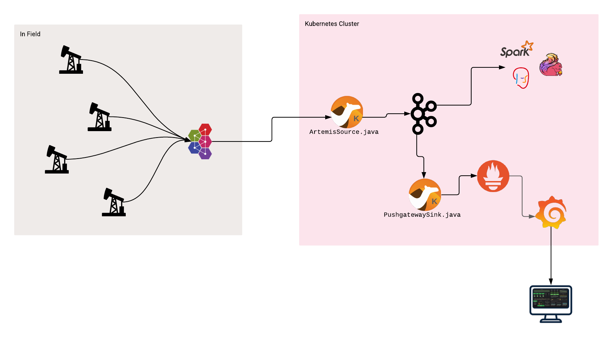

# IoT Demo



## Requirements

- [Apache Maven 3.x](http://maven.apache.org)
- [Red Hat AMQ Broker 7.x](https://developers.redhat.com/products/amq/overview)
- [Red Hat OpenShift 4.x](https://developers.redhat.com/products/openshift/getting-started)
- [Python 3.x](https://www.python.org/downloads/)

## Preparing

```
export PROJECT_ROOT="$(pwd)"

oc new-project streams
oc new-project metrics
oc new-project bridges
```

## AMQ Broker

Install and run Red Hat AMQ Broker [https://developers.redhat.com/products/amq/hello-world]

  _This should be done outside of OpenShift simulating the "Field Environment"._

## AMQ Streams

Install the AMQ Streams Operator from OperatorHub

Create and configure an AMQ Streams cluster

```
oc -n streams apply -f ./streams/kafka-cluster.yaml
oc -n streams apply -f ./streams/kafka-topics.yaml
```

## Prometheus & Grafana

Install the Prometheus Operator from OperatorHub

Create and configure the Prometheus resources

```
oc -n metrics new-app prom/pushgateway -l 'app=iot-demo' -l 'prometheus/type=pushgateway'

oc -n metrics apply -f ./metrics/prometheus.yaml
oc -n metrics apply -f ./metrics/prometheus-pushgateway-service-monitor.yaml
```

Install and configure a Grafana instance

```
oc -n metrics apply -f ./metrics/grafana.yaml
```

Import the Grafana datasource and dashoard found in the `./metrics/grafana/` directory. You can either use the Web UI, or the REST API.

  The Web UI can be found at:

  ```
  echo "http://$(oc -n metrics get route grafana --template='{{.spec.host}}')/"
  ```

## Camel Bridges

### Camel Bridges - Artemis Source

Create the `deployment.yml`, and `configmap.yml` files from the available templates, and update them with your values. These files are ignored by Git to prevent checking in personal/user keys or other secrets.

```
pushd $PROJECT_ROOT/bridges/artemis-source
cp src/main/jkube/deployment.yml.template src/main/jkube/deployment.yml
cp src/main/jkube/configmap.yml.template src/main/jkube/configmap.yml
popd
```

Build and deploy to OpenShift. _Make sure you're logged in to OpenShift and are currently in the namespace you want to deploy to._

```
pushd $PROJECT_ROOT/bridges/artemis-source
oc project bridges
mvn -P openshift clean package oc:deploy
popd
```

### Camel Bridges - Push Gateway Sink

Create the `deployment.yml`, and `configmap.yml` files from the available templates, and update them with your values. These files are ignored by Git to prevent checking in personal/user keys or other secrets.

```
pushd $PROJECT_ROOT/bridges/push-gateway-sink
cp src/main/jkube/deployment.yml.template src/main/jkube/deployment.yml
cp src/main/jkube/configmap.yml.template src/main/jkube/configmap.yml
popd
```

Build and deploy to OpenShift. _Make sure you're logged in to OpenShift and are currently in the namespace you want to deploy to._

```
pushd $PROJECT_ROOT/bridges/push-gateway-sink
oc project bridges
mvn -P openshift clean package oc:deploy
popd
```

## Simulator

You can run the Python script to simulate device telemetry being sent to the AMQ Broker

```
cd $PROJECT_ROOT
python -m venv .venv
source .venv/bin/activate
pip install click paho-mqtt
python simulators/iot/pumpjack/sim.py --location-id field-01 --rig-id pumpjack-01 --broker-username admin --broker-password admin --telemetry-topic 'iot/telemetry' --telemetry-frequency 1 --buffer-timeout 10000 --verbose 'tcp://localhost:1883'
```

You can run `python simulators/iot/pumpjack/sim.py --help` for more details/options

## (Optional) Service Interconnect

Initialize the skupper site. _This can be done on any machine with a `skupper` cli client._

```
skupper -n bridges init --enable-console --console-auth unsecured --enable-flow-collector
```

Initialize the skupper gateway. _This should be done on the machine hosting AMQ Broker._

```
# Make sure you're `oc login ...` to the cluster and in the `bridges` namespace.
skupper gateway init
skupper gateway expose amq-broker localhost 5672
```

Edit the `etc/broker.xml` file and change the acceptors to only listen on `localhost` instead of the default `0.0.0.0`. Restart the broker.

Edit the `artemis-source-configmap` and change the `amqphub.amqp10jms.remote-url="amqp://amq-broker:5672"`. Restart the "artemis-source" pod.
